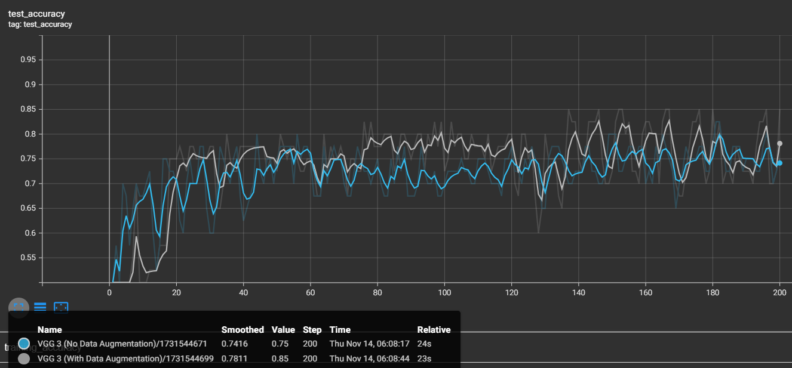
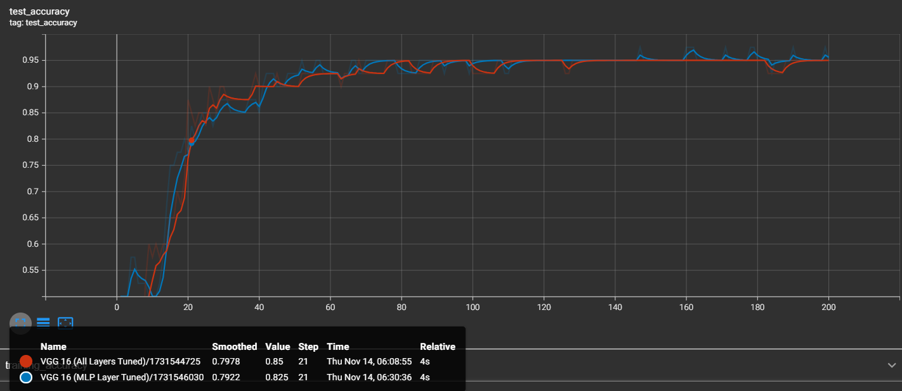
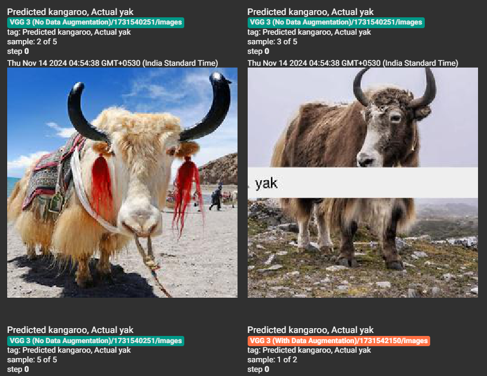
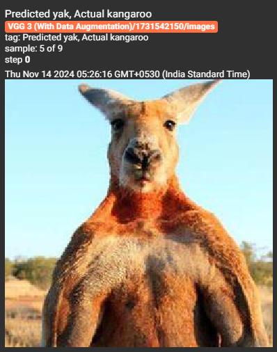
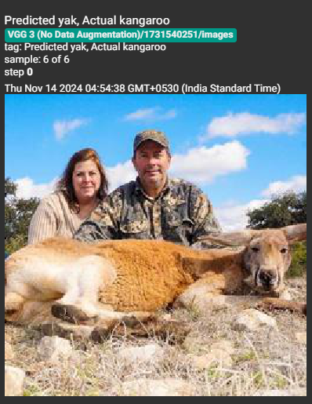

## 1. Are the results as expected? Why or why not?
Yes, results align with our expectations. **VGG16** outperforms **VGG3**, which in turn performs better than **VGG1**. Data augmentation increases accuracy, as seen in the **VGG3** model, which achieves higher accuracy with augmentation than without. Fine-tuning only the **MLP layers** led to a high accuracy of **95%** by **epoch 6**, while tuning all layers reached a lower accuracy in the same period but would likely improve if trained over more epochs.

## 2. Does data augmentation help? Why or why not?

Yes, data augmentation improves accuracy. Data augmentation artificially expands the training dataset by applying transformations (like rotation, flipping, and scaling) to existing images. 

In our case, our training data had 160 images, which were increased to 480 after data augmentation. **VGG3 with augmentation** reaches a higher accuracy of 85% after 20 epochs than without data augmentation(75%), showing that data augmentation helps generalize better. 

## 3. Does it matter how many epochs you fine-tune the model? Why or why not?
Yes, the number of epochs matters. Fine-tuning only **MLP layers** reached **95% accuracy** by **epoch 6**, whereas tuning all layers yielded a similar accuracy but took longer to train.

As we can see in the screenshot above, when we only train the MLP layers, the model initally has a higher test accuracy than when we train all layers. This is because the MLP layers are more specialized in recognizing features of the dataset, while the convolutional layers are more generalized, but take longer to train. However, the model that trains all layers will likely perform better if trained over more epochs, as it has the potential to learn more complex features from the dataset.

## 4. Are there any particular images that the model is confused about? Why or why not?
Yes, certain images consistently confuse the model due to feature similarities between classes.
For example, these Yak images were misclassified by the VGG 1 and VGG 3 models as Kangaroo images: 

The model may have misclassified them due to the angles of the Yaks, as well as the presence of text cropping the body of the Yak on one of the images.  
These Kangaroo images were often misclassified by the VGG 1 and VGG 3 models as Yak images: 

The model may have misclassified these images owing to the angles making the Kangaroos resemble Yaks. 