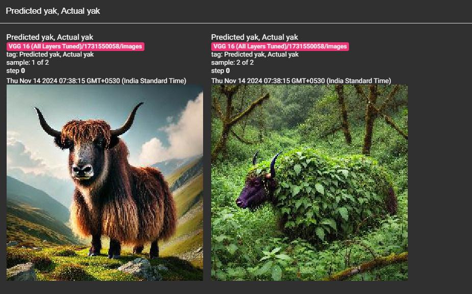
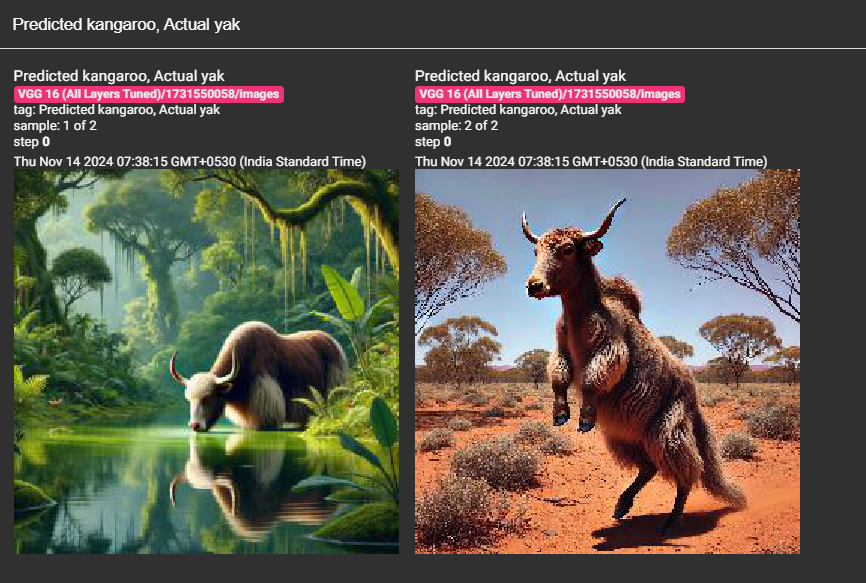
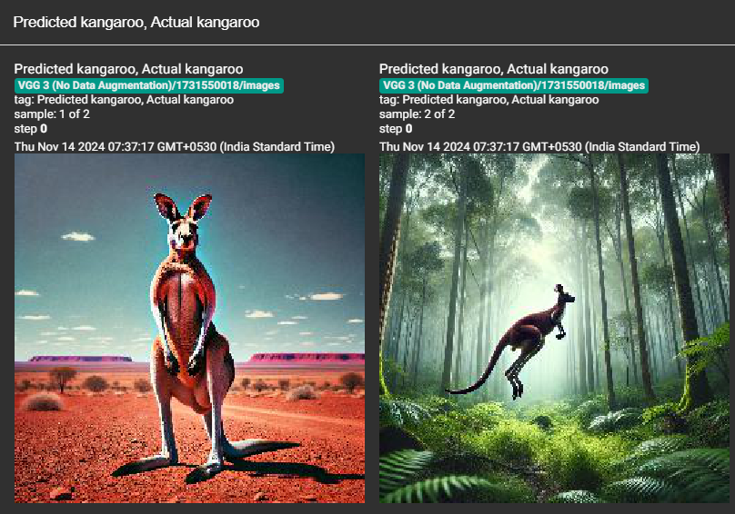
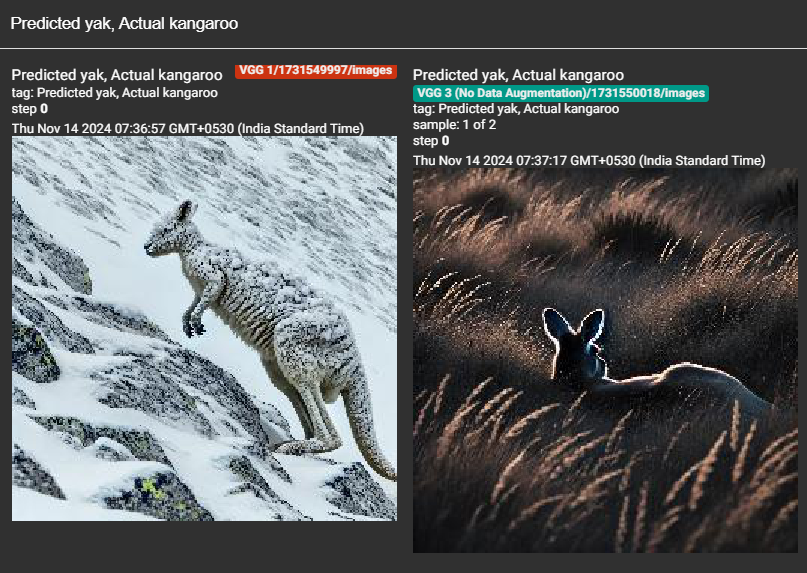

# Image Classification Challenge: Yak vs. Kangaroo

## Yak: Easy to Classify Images

**Prompt 1**: *An adult yak standing on a green hillside in the Himalayas under a clear sky, showcasing its shaggy coat and large curved horns. The yak is in a mount*
- **Reason**: The yak is in its natural habitat, well-lit, and its distinctive features are clearly visible.

**Prompt 2**: *A yak crossing a densely forested region, with its body mostly covered by tall grass, leaves, and branches, making it barely visible.*
- **Reason**: Inspite of the prompt making it difficult to see the yak, the distinctive horns and body are still visible.

---

## Yak: Hard to Classify Images

**Prompt 1**: *A realistic scene of a yak drinking water from a pond in a dense jungle. The yak is near the water’s edge, with its head lowered*
- **Reason**: The dense vegetation and water make it challenging to identify the yak. Even this prompt was supposed to be easy to classify, yet the VGG1 and VGG3 models misclassified it as a kangaroo.

**Prompt 2**: *A yak with minimal fur and no horns, walking upright on strong hind legs in the Australian outback during a hot summer day. The landscape is arid.*
- **Reason**: The pose of the yak with two feet up making it resemble a kangaroo, along with the desert landscape which is more likely to have kangaroos than yaks, makes it challenging to identify the yak.

---

## Kangaroo: Easy to Classify Images

**Prompt 1**: *An adult kangaroo standing upright in the Australian outback during daylight, with a clear blue sky and red earth background, its entire body visible*
- **Reason**: The kangaroo is the main subject, well-lit, and has a clear background.

**Prompt 2**: *A kangaroo clearly visible, jumping through a green forest with tall trees and lush foliage. The kangaroo is mid-leap, with its strong hind legs extended*
- **Reason**: The kangaroo's distinctive jumping pose and the forest setting make it easily recognizable.

---

## Kangaroo: Hard to Classify Images

**Prompt 1**: *A kangaroo covered in snow climbing a mountain, on all four legs, similar to a goat. The kangaroo is surrounded by snow and ice, with its body lowered*
- **Reason**: The snow-covered environment and unusual pose make it challenging to identify the kangaroo.

**Prompt 2**: *A kangaroo lying down among tall grasses at dusk, with shadows casting over its body. Only the kangaroo's back and ears are visible above the grass*
- **Reason**: The kangaroo's obscured body and low lighting make it challenging to identify.
